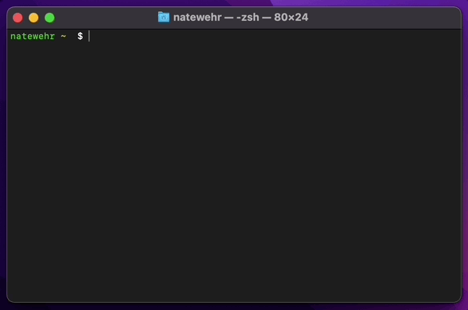
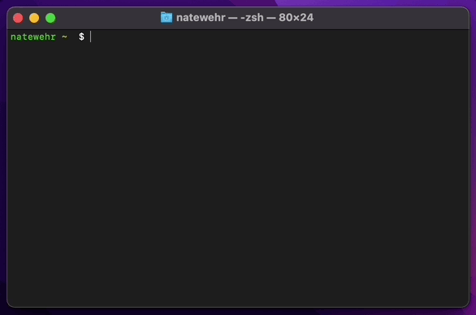

## neopass

`neopass` is a simple password manager that uses [age-encryption.org/v1](https://github.com/FiloSottile/age). By default, passwords are stored in `~/.neopass/default-store.yaml`. They are copied directly to the clipboard and never displayed in the console or in log files. 


Neopass Cloud is a serverless password store. Passwords are only encrypted/decrypted by the client. To use Neopass Cloud pass the `--neopass.cloud` option when initializing a new password store. 

## Install

```
$ brew install nwehr/tap/neopass
```

If you have `fzf` installed you can create an alias for fuzzy finding passwords.

```
alias fzp="neopass $(neopass | fzf)"
```


## Initilize 



Initialize the default store protected with a master password.

```
$ neopass init
password:
```

If you have a security card (i.e. Yubikey) you can pass `--piv [slot]` during initilization. 

```
$ neopass init --piv
```

You can also use Neopass Cloud to store your passwords. 

```
$ neopass init --neopass.cloud
```

You an also share passwords by adding public keys to the list of recipients in the config file `~/.neopass/config.yaml`.

```
currentStore: default
stores:
    - name: default
        location: ~/.neopass/default-store.yaml
        age:
        identity: HSO*7Z:FtO`>'Yo@I.[b89"OA%rZ"clnO#IW81$5in9T+0o<(u%)^*...
        piv:
            slot: 158
        recipients:
            - age1t0v09up9uxslugrqee5kmd5vk85ltekw9xzkchsdpnt78qzp4f0sjl3dz6
            - age1n3c66l076m00ffu2pj84ttcq5x2hy6s7yehngg33qgmgttaqf4tsce5c9q
            - age19grrxqmr0ljux772a8znj5x99tqs4829arfdmystha04egf8rvnqa2nfcp
```

## Use



Add a new password.

```
$ neopass add example.com
password: 
```

Generate a new password.

```
$ neopass gen example.com
copied to clipboard
```

Retrieve a password.

```
$ neopass github.com
copied to clipboard
```

List existing passwords.

```
$ neopass
github.com
digitalocean.com
gitlab.com
godaddy.com
amazon.com
auth0.com
bitpay.com
```

Remove a password.

```
$ neopass rm example.com
```

List password stores.

```
$ neopass store
   default
-> neopass.cloud
```
